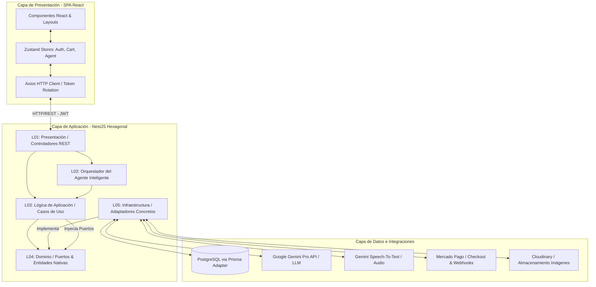
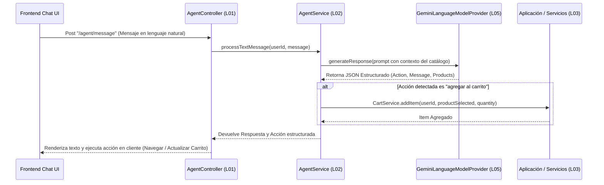

# Informe Profesional de Arquitectura y Diseño del Sistema: Aura Marketplace

---

## 1. Resumen Ejecutivo

El presente documento detalla la especificación y el diseño arquitectónico de **Aura Marketplace**, una plataforma inteligente de comercio electrónico (marketplace multidireccional) orientada a compradores, vendedores y administradores. La ventaja competitiva fundamental de la plataforma reside en la integración de un **agente inteligente conversacional interactivo**, capaz de procesar comandos en lenguaje natural (texto y voz) para asistir a los usuarios en la búsqueda avanzada de productos, control de navegación, administración del carrito de compras y automatización de flujos transaccionales.

El sistema se estructura como un **monorepo** y se compone de los siguientes subsistemas principales:
1.  **Frontend**: Una Single Page Application (SPA) modular, reactiva y altamente interactiva construida con **React 19, TypeScript, Vite, Tailwind CSS** y gestionada a nivel de estado global con **Zustand**.
2.  **Backend modular**: Una API REST robusta desarrollada con **NestJS 10 y TypeScript** que, tras una refactorización estructural profunda, se rige bajo un patrón estricto de **Arquitectura Hexagonal (Puertos y Adaptadores)**.
3.  **Base de Datos y Persistencia**: Un motor relacional gestionado a través de **Prisma ORM** sobre **PostgreSQL (Neon Serverless)**, configurado bajo reglas estrictas de consistencia transaccional y normalización de esquemas.

---

## 2. Arquitectura Global del Sistema

El sistema implementa una **arquitectura cliente-servidor de tres capas físicas (3-tier)** distribuidas para maximizar la escalabilidad, la seguridad perimetral y la mantenibilidad de los subsistemas:

*   **Capa de Presentación (Client-Tier)**: SPA reactiva desplegada de forma estática en plataformas de alto rendimiento a nivel de borde (Edge networks como Vercel o Cloudflare Pages).
*   **Capa de Aplicación y Negocio (Application-Tier)**: Backend modular NestJS desplegado en contenedores PaaS (como Render) con escalabilidad horizontal y balanceo de carga.
*   **Capa de Persistencia y Datos (Data-Tier)**: Base de datos relacional PostgreSQL con soporte transaccional ACID, hosted en Neon DB con escalado automático de cómputo.

El flujo conceptual de comunicación entre los distintos subsistemas e integraciones se ilustra en el siguiente diagrama:



---

## 3. Arquitectura del Backend: Enfoque Hexagonal (Puertos y Adaptadores)

El backend de NestJS ha sido reestructurado a partir de un modelo tradicional en capas hacia una **Arquitectura Hexagonal (Ports & Adapters)** pura. Esta transición aísla por completo el núcleo del negocio (Core Domain) de las tecnologías específicas de infraestructura, permitiendo que la lógica de aplicación sea agnóstica de bases de datos, librerías criptográficas, pasarelas de pago o proveedores de Inteligencia Artificial.

### 3.1 Estructura Exhaustiva de Capas

El backend se organiza en cinco capas lógicas que imponen límites de dependencia estrictos: los componentes externos dependen únicamente de los componentes internos.

#### Capa L04: Dominio (Domain Core)
Contiene las entidades de negocio, enums nativos y las definiciones de los **Puertos (Interfaces)** que rigen los contratos de comunicación con el exterior. Es 100% independiente de NestJS, Prisma u otras librerías externas.
*   **Entidades y Enums Nativos**: Evitan el acoplamiento a los tipos nominales generados por Prisma.
    *   [usuario.entity.ts](file:///c:/Users/tranp_3bhil36/Desktop/Ecommerce/backend/src/l04-domain/auth/usuario.entity.ts): Define `UsuarioEntity`, `RolUsuario` y `EstadoUsuario`.
    *   [product.enums.ts](file:///c:/Users/tranp_3bhil36/Desktop/Ecommerce/backend/src/l04-domain/products/product.enums.ts): Contiene `EstadoPublicacion`.
*   **Puertos (Interfaces de Salida)**:
    *   [user-repository.interface.ts](file:///c:/Users/tranp_3bhil36/Desktop/Ecommerce/backend/src/l04-domain/ports/user-repository.interface.ts): Operaciones de persistencia de perfiles y direcciones de usuario.
    *   [product-repository.interface.ts](file:///c:/Users/tranp_3bhil36/Desktop/Ecommerce/backend/src/l04-domain/ports/product-repository.interface.ts): Operaciones de persistencia e inventariado de productos.
    *   [categoria-repository.interface.ts](file:///c:/Users/tranp_3bhil36/Desktop/Ecommerce/backend/src/l04-domain/ports/categoria-repository.interface.ts): Acceso al árbol de categorías del catálogo.
    *   [cart-repository.interface.ts](file:///c:/Users/tranp_3bhil36/Desktop/Ecommerce/backend/src/l04-domain/ports/cart-repository.interface.ts): Persistencia del estado dinámico del carrito de compras.
    *   [order-repository.interface.ts](file:///c:/Users/tranp_3bhil36/Desktop/Ecommerce/backend/src/l04-domain/ports/order-repository.interface.ts): Lógica transaccional de órdenes, líneas de pedido y validación de cupones.
    *   [payment-gateway.interface.ts](file:///c:/Users/tranp_3bhil36/Desktop/Ecommerce/backend/src/l04-domain/ports/payment-gateway.interface.ts): Abstracción agnóstica para pasarelas transaccionales de cobro.
    *   [cache-provider.interface.ts](file:///c:/Users/tranp_3bhil36/Desktop/Ecommerce/backend/src/l04-domain/ports/cache-provider.interface.ts): Contrato para sistemas de caché.
    *   [hasher.interface.ts](file:///c:/Users/tranp_3bhil36/Desktop/Ecommerce/backend/src/l04-domain/ports/hasher.interface.ts): Criptografía y hashes de contraseñas.
    *   [mail-sender.interface.ts](file:///c:/Users/tranp_3bhil36/Desktop/Ecommerce/backend/src/l04-domain/ports/mail-sender.interface.ts): Envío asíncrono de correos transaccionales.
    *   [review-repository.interface.ts](file:///c:/Users/tranp_3bhil36/Desktop/Ecommerce/backend/src/l04-domain/ports/review-repository.interface.ts): Persistencia de calificaciones y reseñas de productos.
    *   [favorite-repository.interface.ts](file:///c:/Users/tranp_3bhil36/Desktop/Ecommerce/backend/src/l04-domain/ports/favorite-repository.interface.ts): Persistencia del catálogo de favoritos por comprador.
    *   [promotion-repository.interface.ts](file:///c:/Users/tranp_3bhil36/Desktop/Ecommerce/backend/src/l04-domain/ports/promotion-repository.interface.ts): Búsqueda de cupones y promociones vigentes.
    *   [notification-repository.interface.ts](file:///c:/Users/tranp_3bhil36/Desktop/Ecommerce/backend/src/l04-domain/ports/notification-repository.interface.ts): Persistencia del historial de alertas y notificaciones.
    *   [notification-provider.interface.ts](file:///c:/Users/tranp_3bhil36/Desktop/Ecommerce/backend/src/l04-domain/ports/notification-provider.interface.ts): Envío asíncrono de alertas de seguridad y negocio.
    *   [audit-repository.interface.ts](file:///c:/Users/tranp_3bhil36/Desktop/Ecommerce/backend/src/l04-domain/ports/audit-repository.interface.ts): Registro centralizado e inmutable de eventos de auditoría.
    *   [admin-repository.interface.ts](file:///c:/Users/tranp_3bhil36/Desktop/Ecommerce/backend/src/l04-domain/ports/admin-repository.interface.ts): Panel administrativo para reportes globales, suspensión y gestión.
    *   [conversation-repository.interface.ts](file:///c:/Users/tranp_3bhil36/Desktop/Ecommerce/backend/src/l04-domain/ports/conversation-repository.interface.ts): Historial de sesiones, mensajes e intenciones del agente conversacional.

#### Capa L03: Lógica de Aplicación (Application Use Cases)
Define las implementaciones concretas de los casos de uso del marketplace.
*   **Inyección mediante Interfaces**: Los servicios de esta capa (p. ej. `OrdersService`, `ProductsService`, `CartService`) no conocen a Prisma ni a proveedores de pago específicos. En su lugar, inyectan puertos de la Capa L04 a través de tokens nominales en NestJS:
    ```typescript
    constructor(
      @Inject('IOrderRepository') private readonly orderRepo: IOrderRepository,
      @Inject('ICartRepository') private readonly cartRepo: ICartRepository,
      @Inject('IUserRepository') private readonly userRepo: IUserRepository,
    ) {}
    ```
*   **Orquestación Funcional**: El flujo de negocio, las excepciones lógicas y la validación de reglas críticas ocurren en esta capa.

#### Capa L01: Presentación (Presentation / Entry Adapters)
Funciona como el adaptador de entrada principal (REST API).
*   **Controladores REST**: Reciben las peticiones HTTP, parsean payloads DTO, aplican tuberías globales de validación y retornan respuestas JSON estructuradas.
*   **Seguridad y Autorización**: Aplica `JwtAuthGuard` y `RolesGuard` junto con metadatos `@Roles(...)` para restringir el acceso a nivel perimetral de endpoint.

#### Capa L02: Agente Inteligente (Conversational Intelligence Layer)
Capa intermedia especializada que orquesta la entrada conversacional.
*   **AgentService**: Captura mensajes en texto o voz enviados por la interfaz web, invoca los adaptadores de lenguaje e interactúa de manera controlada con la capa de aplicación para consultar existencias de productos, buscar categorías o añadir ítems al carrito, retornando respuestas estructuradas al cliente.

#### Capa L05: Infraestructura (Infrastructure / Exit Adapters)
Contiene las implementaciones específicas de los puertos lógicos declarados en L04. Esta capa actúa como los **Adaptadores de Salida (Exit Adapters)** del sistema.
*   **Adaptadores de Persistencia (Base de Datos)**:
    *   `PrismaUserRepository`, `PrismaProductRepository`, `PrismaCategoriaRepository`, `PrismaCartRepository`, `PrismaOrderRepository`, `PrismaReviewRepository`, `PrismaFavoriteRepository`, `PrismaPromotionRepository`, `PrismaNotificationRepository`, `PrismaAuditRepository`, `PrismaAdminRepository`, `PrismaConversationRepository` que interactúan directamente con `PrismaService` y ejecutan consultas SQL optimizadas sobre la base de datos PostgreSQL.
    *   **Encapsulamiento Transaccional**: Operaciones transaccionales complejas (como la creación atómica de una orden, deducción de stock y vaciado de carrito) se aíslan dentro de `PrismaOrderRepository` usando `$transaction` de Prisma, protegiendo a la capa de aplicación de acoplarse a APIs transaccionales propietarias de ORMs externos.
*   **Adaptadores de Servicios Externos**:
    *   `MercadoPagoService`: Implementa `IPaymentGateway` traduciendo el modelo de dominio nativo a llamadas al SDK oficial de Mercado Pago para procesar brick payments, generar preferencias de cobro e interactuar con webhooks.
    *   `SimpleCacheService`: Implementa `ICacheProvider`, soportando un motor en memoria como fallback o conectándose con un cluster de Upstash Redis distribuido si está configurado.
    *   `Argon2HasherService`: Implementa `IHasher` utilizando la librería de derivación de contraseñas de alta seguridad Argon2.
    *   `DummyMailService`: Implementa `IMailSender` para simulación controlada y pruebas unitarias de envíos de correos de verificación.
    *   `GeminiLanguageModelProvider` y `GeminiSpeechToTextProvider`: Adaptadores que integran la API generativa de Google Gemini para procesamiento conversacional e interpretación semántica de audio.

### 3.2 Diagrama Arquitectónico del Backend (Hexágono de Puertos y Adaptadores)

El desacoplamiento del backend se estructura visualmente bajo el modelo clásico de arquitectura hexagonal:

```text
               +-------------------------------------------------------+
               |                 L05: INFRAESTRUCTURA                  |
               |                                                       |
               |   [PrismaUserRepository]      [SimpleCacheService]    |
               |            |                           |              |
               +------------|---------------------------|--------------+
                            |                           |
                            v                           v
               +------------|---------------------------|--------------+
               |    [IUserRepository]            [ICacheProvider]      |
               |                                                       |
               |                    L04: DOMINIO                       |
               |                                                       |
               |    [IOrderRepository]           [IPaymentGateway]     |
               +------------^---------------------------^--------------+
                            |                           |
                            | (Inyecta)                 | (Inyecta)
               +------------|---------------------------|--------------+
               |            |                           |              |
               |     [OrdersService]            [PaymentsService]      |
               |                                                       |
               |                  L03: APLICACIÓN                      |
               |                                                       |
               |                    [CartService]                      |
               +--------------------^----------------------------------+
                                    |
                                    | (Llama)
               +--------------------|----------------------------------+
               |             [CartController]                          |
               |                                                       |
               |                 L01: PRESENTACIÓN                     |
               +-------------------------------------------------------+
```

---

## 4. Arquitectura del Frontend

El frontend se diseña como una Single Page Application (SPA) modular estructurada para soportar interfaces enriquecidas mediante una jerarquía clara de componentes, enrutamiento semántico y gestión centralizada del estado.

### 4.1 Estructura Exhaustiva de Carpetas y Módulos

El código fuente del frontend dentro de `frontend/src` se organiza de la siguiente manera:

*   `/api`: Centraliza la comunicación externa con el backend.
    *   Encapsula las llamadas HTTP a los controladores del API de NestJS por dominio funcional (p. ej., `admin.ts`, `auth.ts`, `cart.ts`, `categories.ts`, `orders.ts`, `products.ts`, `users.ts`), previniendo la dispersión de URLs y llamadas directas de Axios dentro de la interfaz.
*   `/components`: Componentes visuales reutilizables.
    *   `/ui`: Componentes elementales de la interfaz de usuario (botones, tarjetas, modales, menús, etc.), inspirados en la metodología atómica de Shadcn/ui y estilizados mediante Tailwind CSS.
    *   `/agent`: Módulo del chat conversacional, visor de intenciones y grabador de voz para interactuar con la capa de inteligencia del backend.
    *   `/auth`, `/cart`, `/checkout`: Componentes especializados para los flujos transaccionales correspondientes.
*   `/hooks`: Ganchos personalizados de React para encapsular lógica visual compleja y efectos secundarios de manera limpia y compartida.
*   `/layouts`: Estructuras base de renderizado para control perimetral en cliente.
    *   `ProtectedLayout`: Valida que el usuario cuente con una sesión JWT válida en el cliente.
    *   `RoleLayout` y `RoleRoute`: Evalúa en tiempo de renderizado si el perfil del usuario posee el rol requerido (`COMPRADOR`, `VENDEDOR`, `ADMINISTRADOR`), previniendo fugas de visualización y redirigiendo dinámicamente.
*   `/lib`: Configuraciones de utilidades globales.
    *   `axios.ts`: Cliente HTTP global personalizado. Implementa interceptores transaccionales que adjuntan automáticamente el token de acceso (`Authorization: Bearer <token>`) en cada petición saliente y gestionan la política de rotación y renovación de tokens dinámicos ante códigos de error HTTP 401 de manera transparente para el usuario.
    *   `neon.ts` y validaciones con `Zod`.
*   `/pages`: Páginas completas del sistema que corresponden a las vistas principales.
    *   `/auth`: Login, Registro y Verificación de Correo.
    *   `/catalog` y `/product`: Catálogo interactivo de publicaciones, búsquedas avanzadas y detalle de productos con reseñas.
    *   `/buyer`: Vistas del comprador (favoritos, órdenes emitidas, configuraciones).
    *   `/vendor`: Panel del vendedor para administración de publicaciones propias, stock y seguimiento de órdenes pendientes.
    *   `/admin`: Dashboard de administración con reportes financieros consolidados, listado de usuarios, moderación de productos y gestión de categorías.
*   `/store`: Gestión de estado global y liviana con Zustand.
    *   `authStore.ts`: Estado del perfil autenticado, hidratación automática y políticas de expiración local.
    *   `cartStore.ts`: Maneja el carrito en tiempo real, conteos y sincronización reactiva con la base de datos mediante el puerto de carrito.
    *   `agentStore.ts`: Controla el estado del chat del agente de IA, historiales conversacionales, estados de grabación de voz e intenciones detectadas.
*   `/styles`: Hojas de estilo globales, incluyendo la configuración centralizada de tokens CSS Tailwind.
*   `/types`: Definiciones de interfaces de TypeScript para tipado estricto y seguro de entidades a través de toda la aplicación cliente.

---

## 5. Arquitectura de la Base de Datos y Persistencia

El sistema implementa una base de datos relacional altamente estructurada y normalizada sobre PostgreSQL, utilizando Prisma ORM como la capa abstracta para la generación de esquemas físicos y acceso relacional.

### 5.1 Esquema Relacional e Integridad Referencial

El modelo físico de persistencia en `schema.prisma` define relaciones lógicas bien delimitadas, asegurando la consistencia e integridad referencial en cascada:

```mermaid
erDiagram
    Usuario ||--o| PreferenciasUsuario : tiene
    Usuario ||--o| Carrito : posee
    Usuario ||--o[ Direccion : registra
    Usuario ||--o[ Orden : realiza
    Usuario ||--o[ Sesion : inicia
    
    Publicacion }|--|| Categoria : clasifica
    Publicacion ||--|| Inventario : controla
    Publicacion ||--o[ ImagenPublicacion : contiene
    Publicacion ||--o[ ItemCarrito : agrega
    Publicacion ||--o[ LineaOrden : factura
    
    Carrito ||--o[ ItemCarrito : almacena
    Orden ||--o[ LineaOrden : detalla
    Orden ||--o| Pago : liquida
    
    Sesion ||--o[ Conversacion : agrupa
    Conversacion ||--o[ Mensaje : registra
    Conversacion ||--o[ Intencion : clasifica
    Conversacion ||--o[ EntidadExtraida : extrae
```

### 5.2 Entidades Principales y Restricciones
*   **Identidad y Perfiles**:
    *   `Usuario`: Almacena información de cuentas (`nombre`, `email` indexado y único, contraseñas hash, `estado` y `rol`).
    *   `RefreshToken` y `TokenRevocado`: Tablas dedicadas a soportar la seguridad de sesiones, permitiendo rastrear la vigencia e invalidez de tokens de acceso de manera persistente.
    *   `Direccion`: Soporta múltiples direcciones transaccionales activas asociadas a los perfiles de usuario.
*   **Catálogo de Productos**:
    *   `Categoria`: Diseñado con relación reflexiva (`parentId` apuntando a sí mismo) para soportar la creación de árboles de jerarquías ilimitadas de categorías.
    *   `Publicacion`: Detalla los bienes ofrecidos (`nombre`, `descripcion`, `precio`, `estado` de visibilidad comercial y relación con el vendedor).
    *   `Inventario`: Relacionado 1:1 con la publicación. Registra tanto el stock físico real (`cantidad`) como el stock comprometido transaccionalmente (`cantidadReservada`), previniendo problemas de sobreventa (overselling).
*   **Transaccionalidad (Compras y Facturación)**:
    *   `Carrito` e `ItemCarrito`: Mantienen de forma persistente y agnóstica el estado de la intención de compra del cliente, vinculando una única tabla de carrito por comprador y múltiples ítems.
    *   `Orden`, `LineaOrden` y `Pago`: Entidades inmutables una vez creadas. La orden consolida el monto total y el estado de entrega. El pago almacena la vinculación externa con la pasarela de pagos, número de transacción y estado transaccional.

### 5.3 Optimización y Consistencia Transaccional (ACID)
*   **Índices**: Se configuran índices específicos sobre campos de búsqueda frecuente (p. ej., `estado` y `precio` en `Publicacion`, `codigo` en `Cupon`, `compradorId` en `Orden`) para optimizar el rendimiento de consultas bajo alta concurrencia.
*   **Transacciones del Repositorio**: La creación de órdenes se ejecuta de forma atómica en el adaptador `PrismaOrderRepository` garantizando consistencia semántica:
    1.  Creación de la orden e incremento del contador de cupones aplicados.
    2.  Escritura de líneas de orden inmutables.
    3.  Incremento atómico de `cantidadReservada` en la tabla de inventario por cada ítem.
    4.  Eliminación física de los ítems en el carrito de compras del usuario.
    Si cualquier paso falla, el motor relacional aborta la transacción y revierte todos los cambios a su estado original (Rollback), evitando inconsistencias financieras y de stock.

---

## 6. Agente Inteligente Conversacional

La capa del agente de Inteligencia Artificial (L02 + L05) está aislada a través de puertos del dominio para permitir la sustitución transparente de motores LLM en el futuro.



El flujo conversacional de audio realiza un paso previo de transcripción:
1.  El usuario graba audio en el navegador y el frontend envía el archivo binario a `/agent/voice`.
2.  `GeminiSpeechToTextProvider` actúa como adaptador para transcribir el flujo de audio a formato de texto plano.
3.  El backend redirige el resultado de la transcripción al pipeline conversacional de texto estándar, unificando la lógica de procesamiento.

---

## 7. Mecanismos Transversales de Seguridad y Auditoría

La seguridad en Aura Marketplace se diseña con un enfoque defensivo en profundidad:

1.  **Criptografía y Persistencia Segura**: Derivación de hashes de contraseña mediante Argon2 con parámetros de alta entropía. Las llaves de integración y tokens de firmas de webhooks se inyectan estrictamente a través de variables de entorno seguras controladas por NestJS `ConfigService`.
2.  **Seguridad de Sesiones y Rotación de JWT**:
    *   **Access Token**: Corta duración (15 minutos), firmado digitalmente con claves RSA/SHA256, transportado en cabeceras HTTP Bearer.
    *   **Refresh Token**: Larga duración (7 días), almacenado de forma persistente en base de datos.
    *   **Invalidación Proactiva**: El logout ejecuta una invalidación atómica del refresh token en base de datos e inserta la firma del token de acceso actual en el repositorio `ITokenRevocadoRepository`, previniendo ataques de reutilización de tokens.
3.  **Autorización a nivel de Backend y Frontend**:
    *   **Backend**: `RolesGuard` intercepta cada petición entrante, decodifica el token de acceso firmado, consulta el rol del usuario (`COMPRADOR`, `VENDEDOR`, `ADMINISTRADOR`) y deniega inmediatamente (`403 Forbidden`) si no cumple con las políticas de control de acceso basadas en roles (RBAC).
    *   **Frontend**: Uso de layouts contenedores (`ProtectedLayout`, `RoleRoute`) que validan interactivamente la sesión y permisos en cliente para prevenir accesos no autorizados a rutas protegidas.
4.  **Trazabilidad mediante Auditoría Activa**:
    *   Se implementa `AuditInterceptor` en el backend NestJS que intercepta de forma asíncrona todas las peticiones HTTP que ejecutan mutaciones en la base de datos (peticiones `POST`, `PUT`, `PATCH`, `DELETE`) o consultas administrativas.
    *   Registra de forma inmutable en la tabla `Auditoria` del sistema: la acción ejecutada, la entidad afectada, la dirección IP de origen, el agente de usuario, la fecha y hora exacta, y el identificador del usuario responsable.

---

## 8. Calidad de Software y Mantenibilidad

El proyecto implementa prácticas rigurosas para asegurar la robustez a largo plazo:

*   **Tipado Estricto de TypeScript**: El compilador está configurado con validaciones estrictas en el monorepo para evitar conversiones implícitas o problemas nominales de tipado.
*   **Pruebas Unitarias exhaustivas**:
    *   El backend incluye suites de pruebas unitarias exhaustivas con cobertura colocalizada.
    *   **100% de cobertura** garantizada y validada mediante Jest sobre todas las capas (statements, branches, functions, lines).
    *   Gracias al diseño hexagonal, las pruebas unitarias simulan de forma limpia y directa las interfaces de puertos, aislándose por completo de llamadas a bases de datos físicas o redes externas.
*   **API Auto-documentada**: Los controladores HTTP integran decoradores de Swagger, permitiendo generar e inspeccionar en tiempo real la especificación OpenAPI del sistema en la ruta `/api/docs`.

---

## 9. Hallazgos y Recomendaciones de Arquitectura

Tras la finalización del proceso de refactorización hexagonal pura del backend, se consolidan las siguientes conclusiones de diseño:

1.  **Independencia Tecnológica Lograda**: La lógica de negocio transaccional (como gestión de inventario y órdenes) y de interacción inteligente (agente conversacional) está completamente blindada. Cambiar el motor de persistencia de PostgreSQL a NoSQL, o la pasarela de Mercado Pago a Stripe, solo requiere implementar un nuevo adaptador de infraestructura (Capa L05) sin alterar una sola línea de código en la capa de aplicación o dominio (L03/L04).
2.  **Mantenibilidad de Pruebas**: El desacoplamiento estructural ha erradicado las dependencias ocultas en las pruebas unitarias. Los mocks se inyectan a nivel de interfaz de puerto, acelerando los tiempos de ejecución de las pruebas y garantizando que los cambios en el backend se verifiquen de forma aislada y controlada.
3.  **Trazabilidad metodológica**: La alíneación metodológica del proyecto bajo un enfoque formal de Specification Driven Development conecta de forma natural cada requerimiento del negocio con una abstracción de puerto específica y su validación mediante pruebas automáticas.
