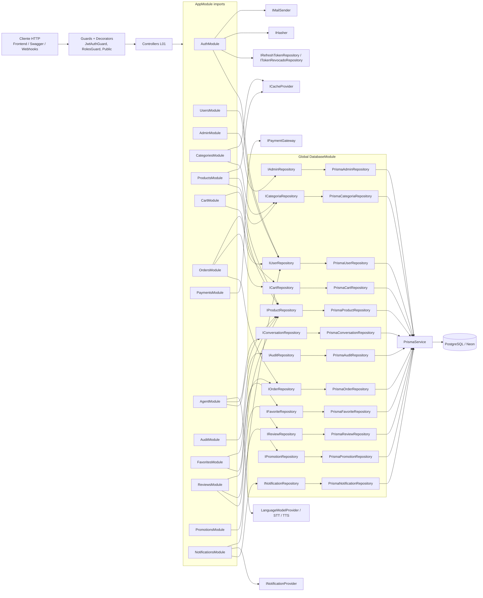
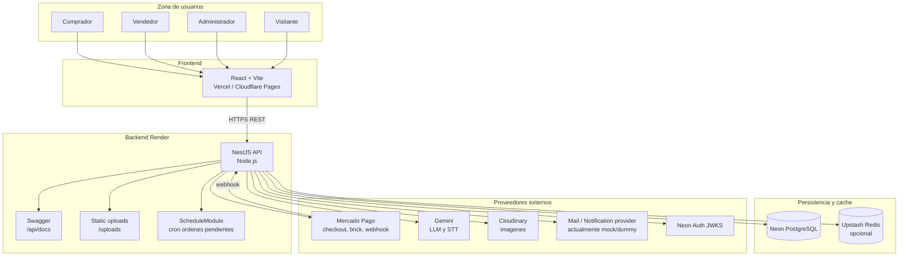
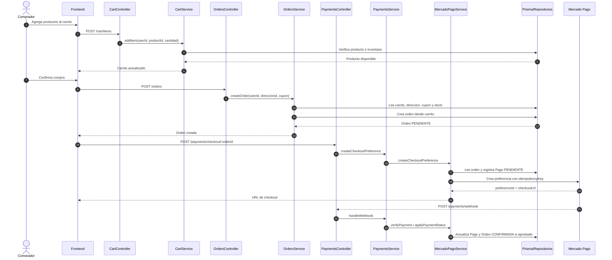
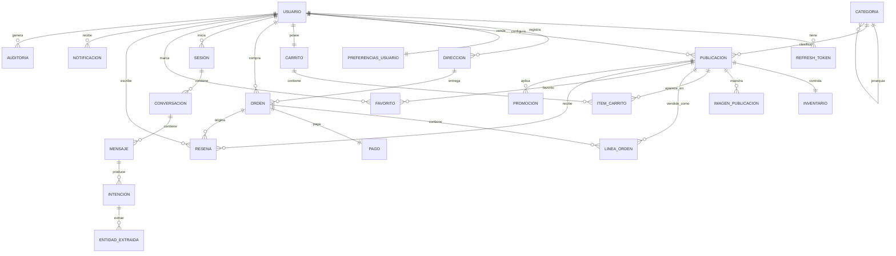

# Arquitectura Backend - Diagramas Mermaid

## Diagnostico rapido

El backend usa una arquitectura por capas con estilo Clean Architecture / Hexagonal:

- `l01-presentation`: controladores REST de NestJS.
- `l02-agent`: agente conversacional y manejo de conversaciones.
- `l03-application`: servicios de aplicacion y casos de uso.
- `l04-domain`: entidades, enums, puertos e interfaces del dominio.
- `l05-infrastructure`: adaptadores concretos, Prisma, cache, pagos, IA, storage y notificaciones.

La regla principal observada es: los servicios de aplicacion consumen interfaces del dominio y la infraestructura implementa esas interfaces con adaptadores concretos.

## 1. Vista Clean Architecture / Hexagonal

```mermaid
flowchart TB
  %% Backend Aura Marketplace - Clean / Hexagonal Architecture

  subgraph External["Actores y sistemas externos"]
    Browser["Frontend React / Vite"]
    Buyer["Comprador"]
    Seller["Vendedor"]
    Admin["Administrador"]
    MP["Mercado Pago"]
    Gemini["Gemini AI / STT"]
    Cloudinary["Cloudinary"]
    Redis["Upstash Redis"]
    Neon["Neon PostgreSQL"]
    MailProvider["Proveedor de notificaciones<br/>actual o futuro"]
  end

  subgraph API["Backend NestJS"]
    Main["main.ts<br/>Bootstrap, CORS, ValidationPipe, Swagger"]
    AppModule["AppModule<br/>Composition Root"]

    subgraph L01["L01 Presentation - Interface Adapters de entrada"]
      AuthCtrl["AuthController"]
      UsersCtrl["UsersController"]
      ProductsCtrl["ProductsController"]
      CategoriesCtrl["CategoriesController"]
      CartCtrl["CartController"]
      OrdersCtrl["OrdersController"]
      PaymentsCtrl["PaymentsController"]
      AgentCtrl["AgentController"]
      AdminCtrl["AdminController"]
      OtherCtrls["Favorites / Reviews / Promotions / Notifications"]
    end

    subgraph L02["L02 Agent - Orquestacion conversacional"]
      AgentSvc["AgentService"]
      ConversationSvc["ConversationsService"]
    end

    subgraph L03["L03 Application - Casos de uso"]
      AuthSvc["AuthService / NeonAuthService"]
      UsersSvc["UsersService"]
      ProductsSvc["ProductsService"]
      CategoriesSvc["CategoriesService"]
      CartSvc["CartService"]
      OrdersSvc["OrdersService"]
      PaymentsSvc["PaymentsService"]
      AdminSvc["AdminService"]
      AuditSvc["AuditService + AuditInterceptor"]
      SupportSvc["Favorites / Reviews / Promotions / Notifications"]
    end

    subgraph L04["L04 Domain - Nucleo"]
      Entities["UsuarioEntity<br/>RefreshTokenEntity<br/>Product enums"]
      Ports["Ports<br/>IUserRepository, IProductRepository,<br/>ICartRepository, IOrderRepository,<br/>IPaymentGateway, IHasher,<br/>ICacheProvider, AI Providers, etc."]
      Rules["Reglas e invariantes<br/>roles, estados, stock, pagos, ordenes"]
    end

    subgraph L05["L05 Infrastructure - Adaptadores de salida"]
      PrismaAdapters["Prisma repository adapters"]
      PrismaSvc["PrismaService"]
      Hasher["Argon2HasherService"]
      PaymentAdapter["MercadoPagoService"]
      AiAdapters["GeminiLanguageModelProvider<br/>GeminiSpeechToTextProvider<br/>MockTextToSpeechProvider"]
      CacheAdapter["SimpleCacheService"]
      StorageAdapter["CloudinaryService / MockStorageProvider"]
      NotifyAdapter["ResendMailService / ConsoleMailService<br/>MockNotificationProvider"]
    end
  end

  Buyer --> Browser
  Seller --> Browser
  Admin --> Browser
  Browser --> Main --> AppModule --> L01

  AuthCtrl --> AuthSvc
  UsersCtrl --> UsersSvc
  ProductsCtrl --> ProductsSvc
  CategoriesCtrl --> CategoriesSvc
  CartCtrl --> CartSvc
  OrdersCtrl --> OrdersSvc
  PaymentsCtrl --> PaymentsSvc
  AgentCtrl --> AgentSvc
  AdminCtrl --> AdminSvc
  OtherCtrls --> SupportSvc

  AgentSvc --> ConversationSvc
  AgentSvc --> Ports
  L03 --> Ports
  Ports --> Entities
  Ports --> Rules

  PrismaAdapters -. implementan .-> Ports
  Hasher -. implementa .-> Ports
  PaymentAdapter -. implementa .-> Ports
  AiAdapters -. implementan .-> Ports
  CacheAdapter -. implementa .-> Ports
  NotifyAdapter -. implementa .-> Ports

  PrismaAdapters --> PrismaSvc --> Neon
  PaymentAdapter --> MP
  PaymentAdapter --> PrismaSvc
  AiAdapters --> Gemini
  CacheAdapter --> Redis
  StorageAdapter --> Cloudinary
  NotifyAdapter --> MailProvider
```

## 2. Vista de modulos funcionales NestJS

## 3. Vista de despliegue e integraciones

## 4. Flujo de compra y pago

## 5. Modelo de dominio resumido

## Herramienta recomendada para graficos profesionales

Para documentacion tecnica rapida y mantenible, Mermaid es suficiente. Para diagramas mas profesionales y consistentes a nivel arquitectura recomiendo:

- Structurizr DSL: ideal para C4 Model, arquitectura empresarial y documentacion viva.
- D2: muy bueno para diagramas limpios, modernos y con mejor control visual que Mermaid.
- diagrams.net / draw.io: mejor si quieres una imagen estilo presentacion como la referencia.
- PlantUML: fuerte para UML clasico y secuencias, menos moderno visualmente.

Mi recomendacion para este backend: Mermaid para README/documentacion del repositorio, y Structurizr o D2 si necesitas laminas profesionales para informe o exposicion.
